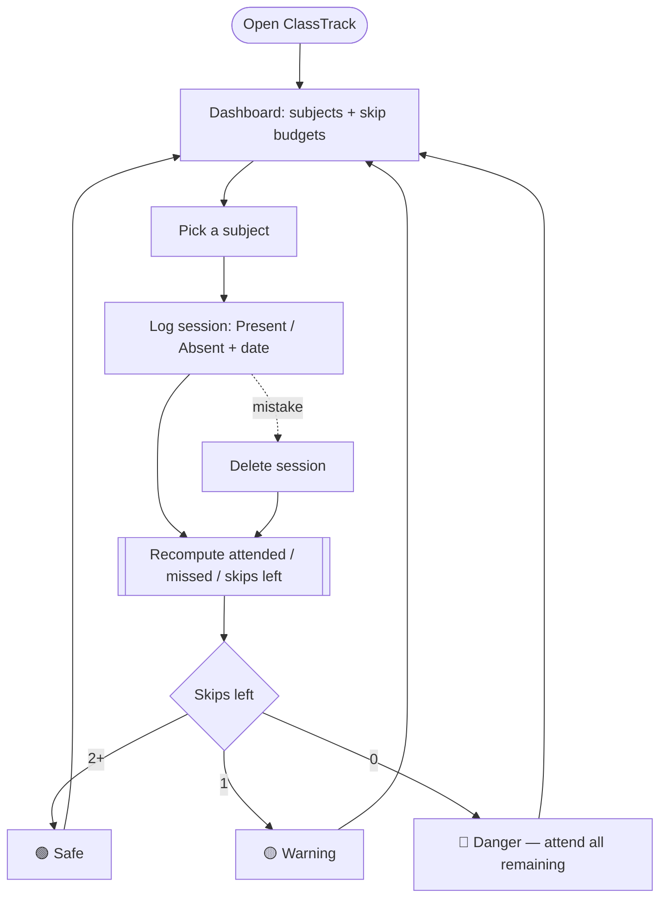
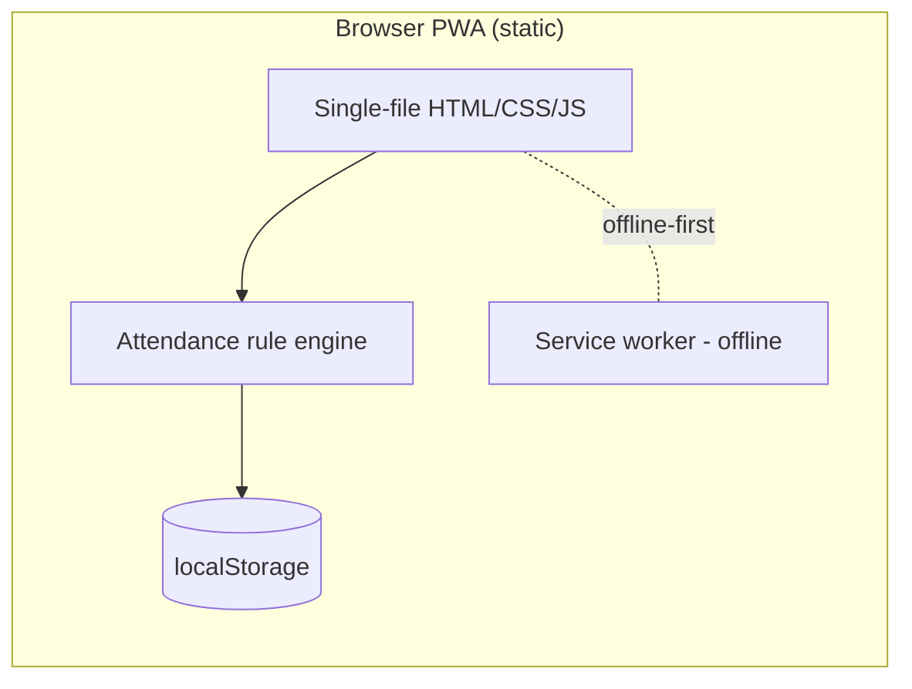
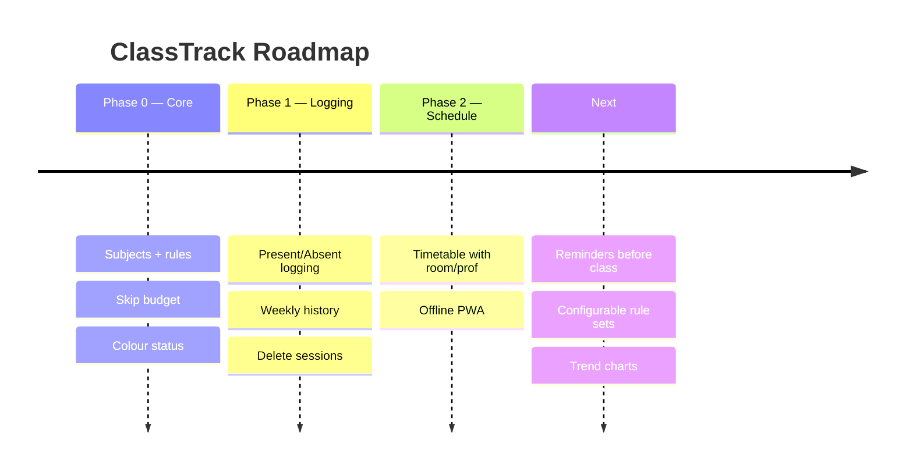
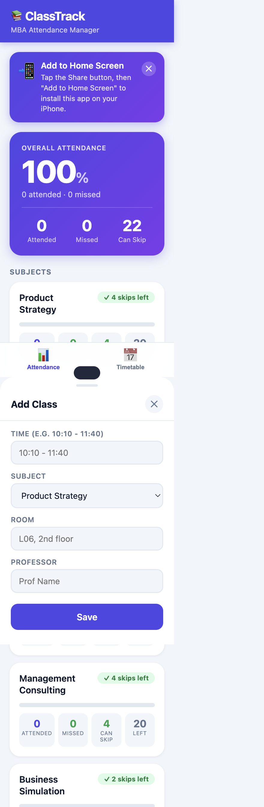

# ClassTrack — Product Requirements Document & Case Study

> **Never accidentally cross your attendance limit.** A PWA that tracks MBA class attendance across subjects and tells you exactly how many classes you can still safely skip.

| | |
|---|---|
| **Live app** | https://aastha381.github.io/Attendence-Tracker-App/ |
| **Repository** | https://github.com/AASTHA381/Attendence-Tracker-App |
| **Author** | Aastha Saini |
| **Status** | Shipped (PWA) |
| **Type** | 0→1 consumer productivity (utility) |
| **Doc version** | 1.0 |

---

## 1. TL;DR (Loom-style walkthrough script)

> *This is ClassTrack. B-schools have a hard attendance rule — miss more than a set number of classes in a subject and you're detained or lose marks. But nobody actually tracks it per subject, so people either over-attend out of fear or accidentally cross the line.*
>
> *ClassTrack turns that anxiety into a single number: "you can still skip N classes." You log each session as present or absent, and every subject shows a colour-coded status — green if you've got room, yellow at your last skip, red when you're out. It's a tiny, focused utility that removes a real recurring worry, works offline, and installs to your home screen.*

**Elevator pitch:** *A traffic-light for your attendance — know your safe skip budget at a glance.*

---

## 2. Problem Statement

Attendance rules are strict and per-subject, but students track them **in their heads or not at all**, leading to anxiety and accidental violations.

**The core problem:**
> Students can't easily see, per subject, how many more classes they can miss without breaching the minimum-attendance rule — so they either waste attendance out of fear or breach it by accident.

**Signals:**
- Fixed rules (e.g. 20 sessions/subject, max 4 misses, 80% minimum) that are easy to miscount.
- Real consequences: detention, grade penalties.
- No purpose-built, per-subject tracker.

**Hypothesis:**
> If students see a live "safe skips left" number per subject, they'll manage attendance confidently and never breach by accident.

---

## 3. Research

### 3.1 Method
- First-hand student pain; encodes the actual institutional rule set.

### 3.2 Key insights
| # | Insight | Implication |
|---|---------|-------------|
| 1 | The useful number is "skips left", not "% attended". | Lead with a **skip budget** per subject. |
| 2 | Anxiety spikes near the limit. | **Colour-coded** green/yellow/red status. |
| 3 | Logging must be frictionless. | One-tap **Present/Absent** with date. |
| 4 | Mistakes happen. | Allow **deleting** a mis-logged session. |
| 5 | Used between/after classes, often offline. | **Offline-first PWA**. |

### 3.3 Competitive landscape
| Alternative | Reality | Gap ClassTrack fills |
|---|---|---|
| Mental math | Error-prone, stressful | Automatic, exact |
| Generic spreadsheet | Manual, no status logic | Purpose-built skip budget |
| College portal | Backward-looking, clunky | Forward "can I skip?" answer |

---

## 4. User Personas

### Primary — "Rule-anxious Riya" 🎯
| Attribute | Detail |
|---|---|
| Who | MBA student under a strict attendance policy |
| Pain | Terrified of accidentally crossing the miss limit |
| Goal | Confidently use her allowed skips (e.g. for interviews) |
| Wins | A clear "N skips left" per subject |

### Anti-persona
Students with no attendance policy — no need.

---

## 5. Goals & Success Metrics

### North Star Metric
> **Sessions logged** (the habit that makes the skip budget accurate).

### Supporting metrics (proposed)
| Category | Metric | Target |
|---|---|---|
| Activation | % who log ≥1 session in week 1 | ≥ 70% |
| Habit | Avg logging frequency | ~2/week/subject |
| Value | Zero accidental limit breaches among users | 100% |
| Retention | Active through the term | ≥ 50% |

### Guardrails
- Correct math for every rule config; offline reliability; data never lost.

---

## 6. Solution & MVP Scope

**Solution:** A focused PWA that models each subject's attendance rules and surfaces a live, colour-coded "safe skips" budget.

### MVP (shipped)
| Capability | Description |
|---|---|
| 📊 **Dashboard** | All subjects at a glance, colour-coded |
| 🔢 **Skip counter** | Live "can skip" number per subject + overall |
| 🚦 **Status** | 🟢 Safe · 🟡 Warning · 🔴 Danger |
| 📝 **Session logging** | Present/Absent with date |
| 🗓️ **Weekly grouping** | History grouped by week |
| 🗑️ **Delete** | Fix mis-logged sessions |
| 📅 **Timetable** | Class schedule with room/professor |
| 📲 **Offline PWA** | Installable, works offline |

### Out of scope
- Auto-detect attendance, multi-college rule import, notifications.

---

## 7. User Flow (Flowchart)



---

## 8. System Architecture



**Key decisions**
- **Client-only, localStorage** — private, offline, zero backend/cost.
- **Rule engine encodes the policy** (sessions, max misses, minimum %) so the "skips left" number is always correct.

---

## 9. Wireframe (low-fidelity)

```
┌──────────────────────────────┐
│  📚 ClassTrack                │
│  Overall: 100%  · Can skip 22 │
├──────────────────────────────┤
│  Product Strategy  ✓ 4 left   │  🟢
│  0 attended · 0 missed        │
│ ──────────────────────────── │
│  Business Simulation ✓ 2 left │  🟢
├──────────────────────────────┤
│  📊 Attendance   📅 Timetable │
└──────────────────────────────┘
```

Shipped UI in **Section 11**.

---

## 10. Roadmap



---

## 11. Screenshots

### Dashboard — subjects & safe-skip budgets


---

## 12. Key Decisions & Trade-offs

| Decision | Options | Choice & why |
|---|---|---|
| **Headline metric** | % attended vs skips left | **Skips left** — the decision-useful number. |
| **Storage** | Cloud vs local | **localStorage** — private, offline, free. |
| **Scope** | Feature-rich vs focused | **Focused utility** — does one job perfectly. |

---

## 13. What I'd do next
1. **Pre-class reminders** ("you can skip this one"). *(engagement)*
2. **Configurable rule sets** per college/subject. *(reach)*
3. **Attendance trend charts**. *(insight)*

---

## 14. Appendix — Tech
- Single-file vanilla JS PWA, localStorage, service-worker offline, GitHub Pages.
